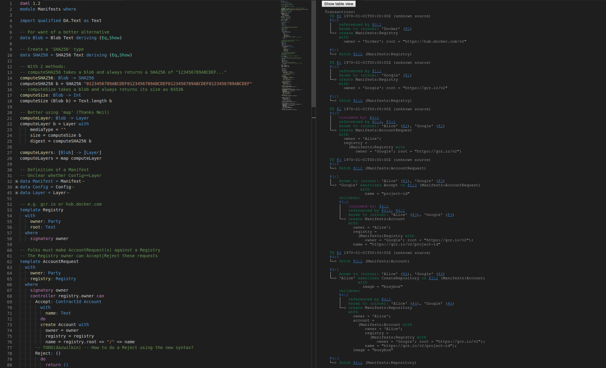

# Container Image Manifests

## Background

See: [Adventures w/ Container manifests](https://medium.com/google-cloud/adventures-w-docker-manifests-78f255d662ff)


## Summary of Concepts

The following entities are represented:
* Registry
* "Account"
* Repository (!)
* Image
* Manifest

**N.B.**: Disambiguation of Registry and Repository

Registry/-ies are implemented by service providers, e.g.:
* Docker ([dockerhub](hub.docker.com))
* Google Container Registry (e.g. service endpoint: [gcr.io](gcr.io) --> [Container Registry]
(cloud.google.com/container-registry))
* Quay etc.

One Registry supports multiple "accounts", e.g.:
* My account on dockerhub: hub.docker.com/u/dazwilkin
* A Project account (e.g. `google-containers`) on GCR

Accounts may contain multiple Repository/-ies, e.g.
* cloud.docker.com/u/dazwilkin/repository/list
* gcr.io/google-containers --> console.cloud.google.com/gcr/images/google-containers/GLOBAL


## DAML

```
git clone git@github.com:DazWilkin/manifests.git
code --new-window manifests
```

The SDK uses Visual Studio Code and provides a runtime environment for scenarios:



### Template(s)

* Registry
* AccountRequest --> Account
* Repository
* ImageRequest --> Image (incl. Manifest)

Flow:
* A Party (e.g. a notional Google) creates a Registry with a single property 'root', e.g. "gcr.io/v2"
* A Party (e.g. one of us) creates an AccountRequest referencing a Registry and providing an (account) name, e.g. "dazwilkin"
* The Registry owner (Party) can Accept the AccountRequest creating an Account, or Reject it.
* An Account has an owner (Party), a Registry and a name, e.g. "gcr.io/v2/dazwilkin"
* An Account owner may then create a Repository (unilaterally) with an image name, e.g. "busybox"
* A Repository owner may create an ImageRequest comprising a repository and a list of Blob(s)
* A Registry owner (Party) can CreateManifest returning an Image to the owner for the repository and the Manifest.

**N.B.** No actual SHA256 computations are performed. The Manifest reflects the correct structure.

### Type(s)

* Blob (Text)
* SHA256 (Text)
* Manifest = Config + [Layer(s)]

## References

* [The Update Framework](https://theupdateframework.github.io/) -- Thanks Daniel